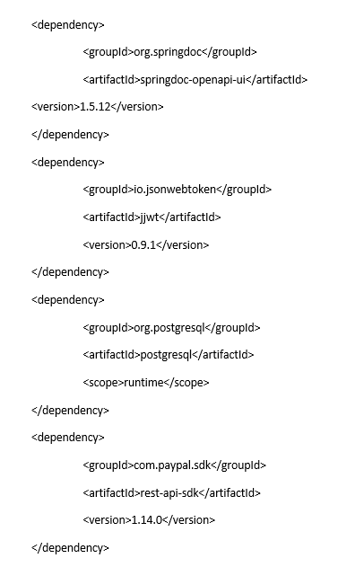

# paypal-java-capstone-project

###Raul and Matthew Project 3

##Getting Started
1. Create a new database called _**projectthree**_ in postgres and connect to it.
    a. \c projecthree

Welcome to the Giving App Project with Java Spring Boot

This project involved using a REST API for a donation database that allows users to view a list
of charities and allows them to select a charity they wish to donate to. The database has 
endpoints for users, which require proper authentication using JSON Web Token. 

In the Giving application you will be able to show your giving spirit by allowing you to donate
to worthy causes. A user is provided with a list of charities, which were verified a true non-profits
using a boolean logic. A user is able to become a sender and receiver based on selected roles.

A user is able to create a new charity with a fundraising goal and is able to
keep track of that goal as they receive payments. 

## Original Entity Relationship Diagram (ERD):

## Final Entity Relationship Diagram (ERD):

