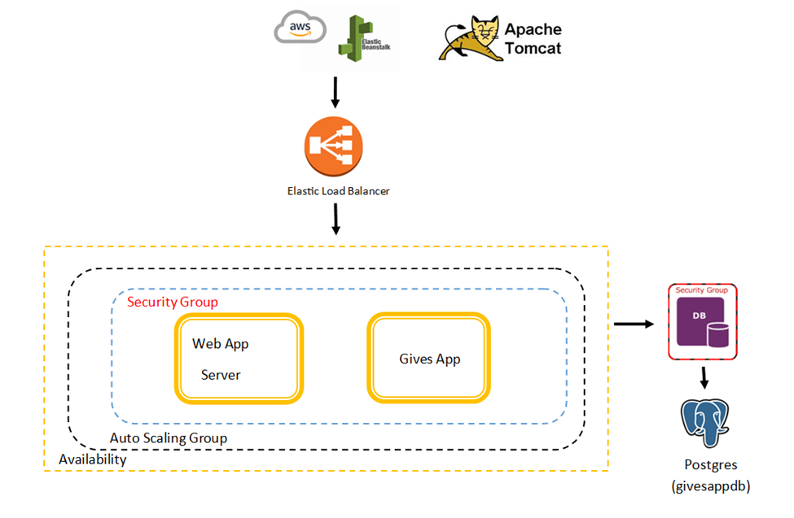
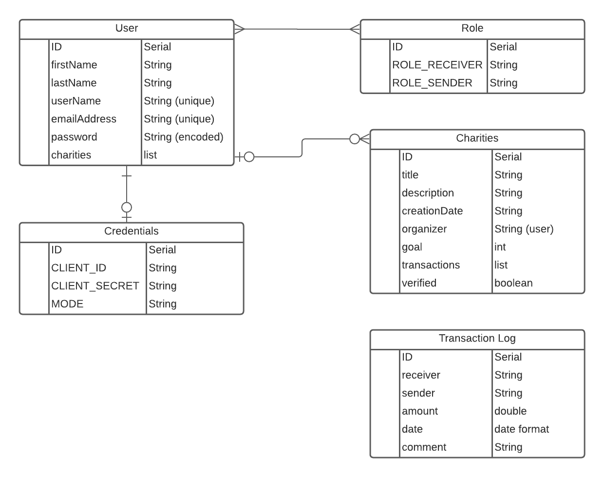
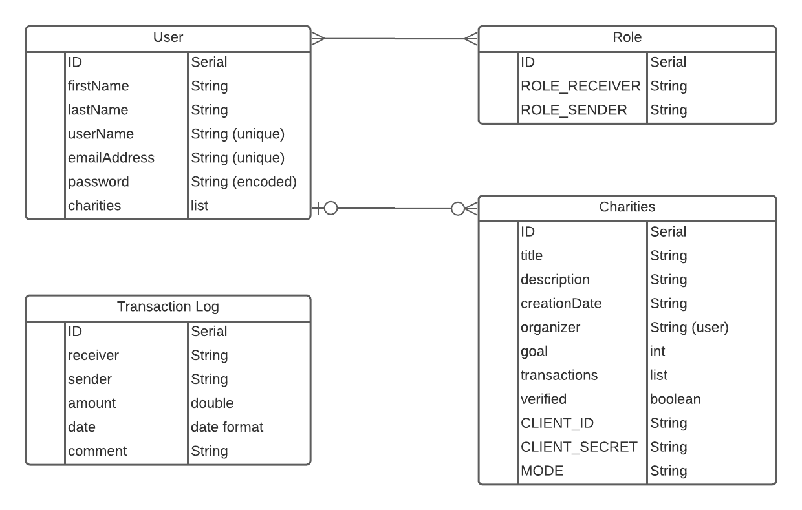
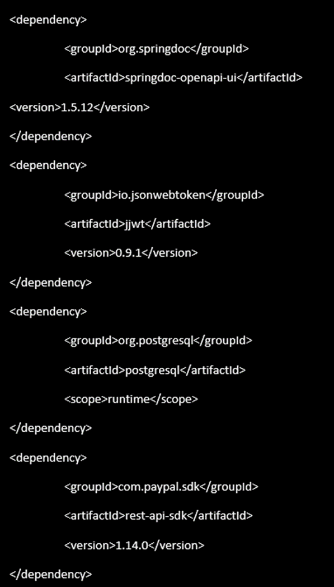
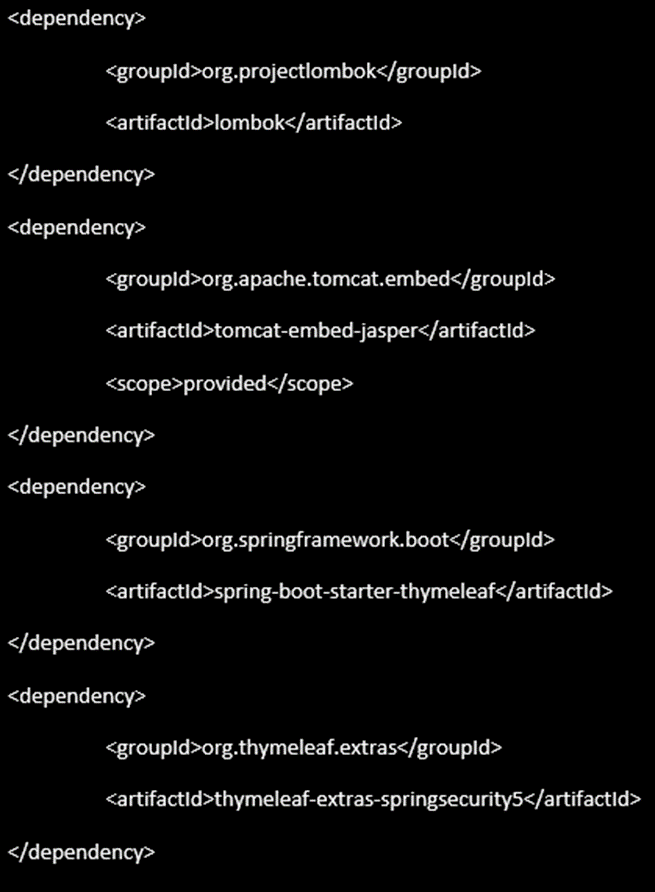

# paypal-java-capstone-project

## Raul and Matthew Project 3

## Getting Started

1. Create a new database called projectthree in postgres and connect to it. a. \c projecthree

http://givesapp-env.eba-c8kim7yp.us-east-2.elasticbeanstalk.com/

## Cloud Structure

http://givesapp-env.eba-c8kim7yp.us-east-2.elasticbeanstalk.com/swagger-ui/index.html?configUrl=/api-docs/swagger-config#/
### Welcome to the Giving App Project with Java Spring Boot

This project involved using a REST API for a donation database that allows users to view a list
of charities and allows them to select a charity they wish to donate to. The database has 
endpoints for users and admins, which require proper authentication using a JSON Web Token. 

In the Giving application you will be able to show your giving spirit by allowing you to donate
to worthy causes. A user is provided with a list of charities, which were verified as true non-profits
using a boolean logic. A user is able to become a sender and receiver based on selected roles.

A user is able to create a new charity with a fundraising goal and is able to
track that goal as they receive payments. 

## Original Entity Relationship Diagram (ERD):

## Final Entity Relationship Diagram (ERD):

## POM Dependencies

## Endpoints
|ENDPOINT  | FUNCTIONALITY  |ACCESS |
| --- | :--- | :---|
|GET/(website) | GET Homepage | Public
|GET/users/people | GET all users | Public
|GET/userId | GET a single user | Public
|GET/userId/edit | EDIT a user | User
|GET/log_out | GET user log out | Logged in users
|POST/login | POST to login | Public
|POST/register | POST for users to register | Public
|POST/users/add | ADD a new user | Public
|GET/transaction | GET all transactions | Admin
|GET/transactionId| GET a single Transaction | Admin
|GET/add | ADD a transaction | Logged in users
|POST/transactions/transactionId | UPDATE a transaction | Admin
|DELETE/transaction | DELETE a transaction | Admin
|GET/charities | GET all charities | Public
|GET/charities/charityId | GET a single charity | Public
|POST/charities/add | ADD a new charity | Logged in users
|POST/charities/charityId/edit | UPDATE a charity | Logged in users
|DELETE/charities/charityId | DELETE a charity | Admin
|GET/charities/charityId/checkout | DONATE to a charity | Public
| | |

## System Tools Used

|  |  |
| --- | :--- |
|  | Spring Boot 
|  | Postman
|| PayPal
|  | Json Web Tokens
|  | IntelliJ IDEA 17
| | Postgres
| | LucidApp
| | Thymeleaf
| | GitHub Branching

## User Stories

| | 
|:---|
|1.	As a user, I would like to view a list of charities.
|2.	As a user, I would like to view details of a specific charity.
|3.	As a user, I would like to donate to any charity I choose.
|4.	As a user, I would like to log in.
|5.	As a user, I would like to donate without login in.
|6.	As a user, I would like to use my PayPal account to donate.
|7.	As a user, I would like to create a charity.
|8.	As a user, I would like to delete my charity.
|9.	As a user, I would like to update my charity.
|10. As a user, I would like to set fundraising goal.
|11. As a user, I would like to keep track of a fundraising total.
|12. A user can have an admin role or user role. 

## Project Challenges

1. Using a single GitHub repository proved to be challenging; however, after some research we
   were able to figure it out and solve the issue. We ended up creating a "matthew" and "raul" 
   branch, which we utilized to make changes to the "Master" branch by merging our code. 

2. The first coding challenge we faced was creating a user with login credentials using JWT. We realized 
   the error was in our coding as the JWTUtils did not have the correct parameters in our class regarding
   Secret Key. Once this was corrected, we were able to generate a JWT Token for an admin and a user. 

3. Another challenge that appeared occurred during the credentials set up as the user or admin were unable
   to create a charity due to the authentication process not passing through to the web application. This
   caused us to refactor the code and remove the credential classes. The credentials were then added to the
   charity class as a user or admin can be tied to each fundraising charity. 

4. During the creation of a new charity, the URL re-direct would not pass the method for this class, this was
   resolved by re-creating the Charities HTML-file with a re-direct for creating and updating a charity at
   the same time. 

5. Uploading the application in AWS was a significant challenge as the JSP files did not re-route the endpoints
   correctly, which caused the application to fail. This caused significant changes to the code in order for the
   application to be launched in AWS. This was the most time-consuming issue we faced. 

